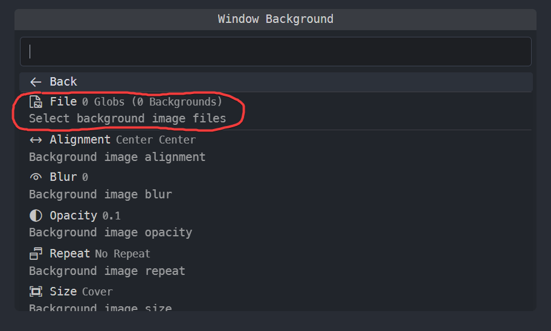
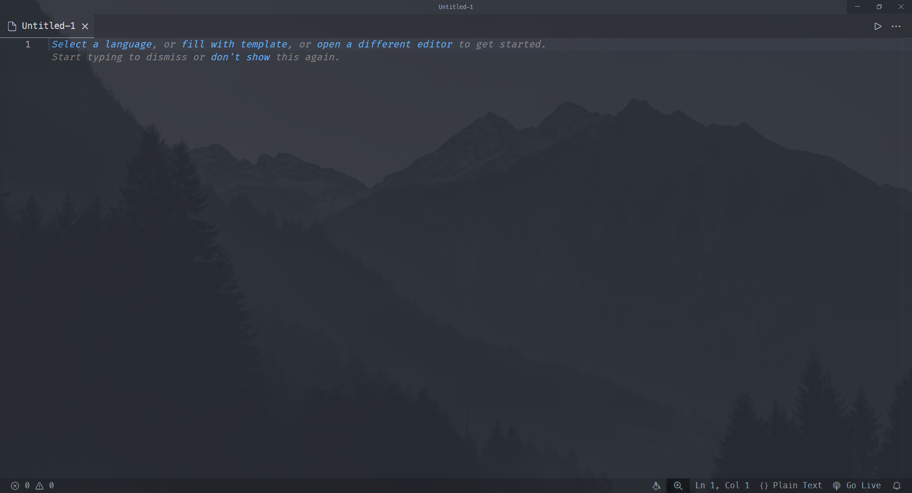
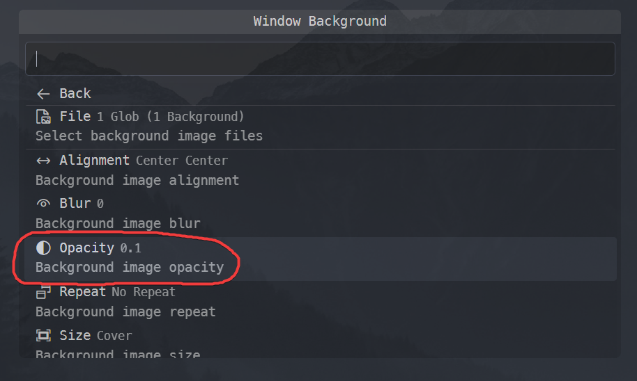
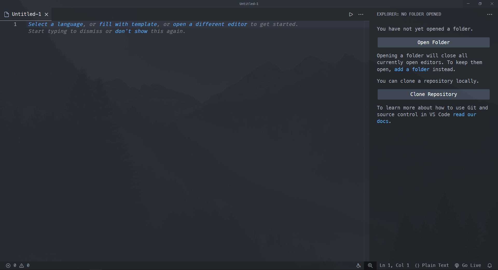

# vscode-config

This is where you can find my Visual Studio Code themes, customizations and settings i use on a daily basis. This will also show you a guide on how you can make modifications to your editor using custom css and a custom background like i have in the screenshot 


You can also import my settings, customizations and the custom css onto your editor.


### Extensions used for the Theme:

- [Catppuccin Icons]
- [One Dark Pro]
- [Background]
- [Custom CSS and JS Loader]

### Fonts I Use:
- FiraCode Nerd Font
- Hack Nerd Font
- Meslo Nerd Font
  


## Here's a guide on how you can use custom css to modify how your editor looks:

### Step 1 :

Install the [Custom CSS and JS Loader](https://marketplace.visualstudio.com/items?itemName=be5invis.vscode-custom-css) extenstion from the vscode marketplace

### Step 2 : 

Copy and paste this code format into your `settings.json` file in vscode and put the path of the css file in there (Example: file:///C:/Users/YourUserName/Documents/style.css), you can also copy and paste my css configuration file and add it in there aswell


```json
"vscode_custom_css.imports": [
    "[FILE PATH OF THE CSS FILE]"
],
```


### Step 3 :

Press `Ctrl + Shift + P` on your keyboard to bring up the command palette, and enable `Custom CSS and JS`

After that, press `Restart Visual Studio Code`

If Visual Studio Code complains that, **"Your Code installation appears to be corrupt"**, **IGNORE IT**, this method modifies the core files of vscode files in your directory since it's a web app (electron app) so be aware what you are doing!!! 

Don't worry, this method won't break your vscode editor and it's safe to do it, you can always revert your css modifications at any time by disabling the custom css and js loader from the command palette


Everytime you make changes to the css file needed to modify the editor, always try and reload the **"Custom CSS and JS Loader"** from the command palette when doing so. Therefore that will reload the Visual Studio Code editor after making changes to the css file 


## Here's another guide on how to get a custom background on your code editor like i have: 

### Step 1 :

Make sure you have the [Background](https://marketplace.visualstudio.com/items?itemName=Katsute.code-background) extension installed in your vscode editor

### Step 2 :

Open up the command palette and select `Background: Install` , this will install and enable the background on your editor


### Step 3 :

Open the command palette and select `Background: Configuration` , then select `Window` and leave everything else


##### There are a few settings that you need to configure for this to work


- ### File:
  
   After you selected the `Window` button, select `File`, then it will give you options on how you can apply the background to your editor
   


   Select `Add a File`, the explorer window will pop up, you have to pick any image as a background. For instance, i'm going to pick this wallpaper and select it
   
    

   After you've done that, click `Install and Reload` 

    
   
   Your editor will look something like this, the only thing left to configure is the opacity of the background that we just applied
   

- ### Opacity:
  
  Open up the command palette again, select `Background: Configuration`, then select `Window`, after that, select `Opacity`

  
  

  

  Set the opacity of the background to be **0.04**, after doing so, click `Install and Reload` to reload the editor


  **And there you have it! You now have a custom background on your Visual Studio Code Editor**
  


---
Now that you're done with following the instructions, you're all set!

Feel free to change or explore anything in my settings to your liking in the Visual Studio Code editor after importing them! :]


[Catppuccin Icons]: <https://marketplace.visualstudio.com/items?itemName=Catppuccin.catppuccin-vsc-icons>

[One Dark Pro]: <https://marketplace.visualstudio.com/items?itemName=zhuangtongfa.Material-theme>

[Custom CSS and JS Loader]: <https://marketplace.visualstudio.com/items?itemName=be5invis.vscode-custom-css>

[Background]: <https://marketplace.visualstudio.com/items?itemName=Katsute.code-background>

